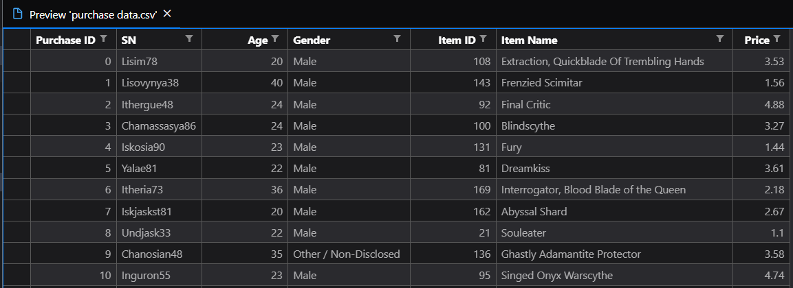
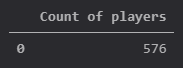
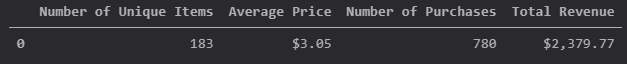
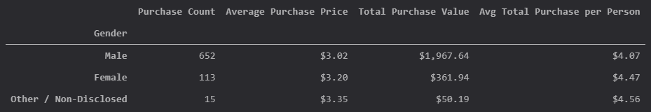
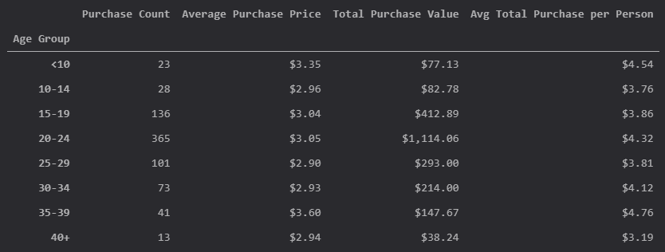
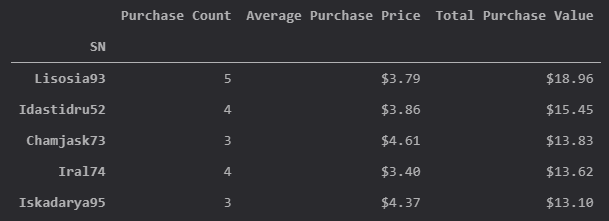
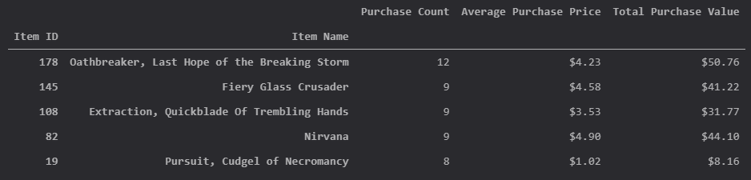
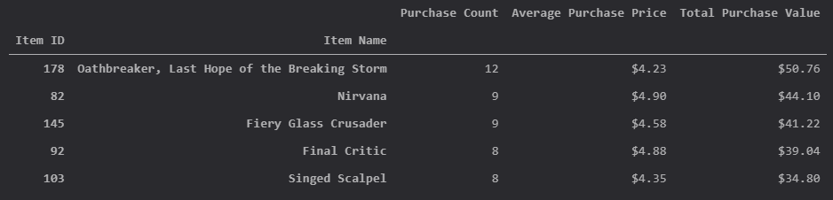

# Data mining with Pandas library

Excercise with gaming data to gather information from a DataFrame. 

## Data

This execise was done with a csv file with fictional data from a game called Heroes of Pymoli, where players can make purchases to enhace their game experience. The csv file contains 7 columns, `Purchase ID`, `SN`, `Age`, `Gender`, `Item ID`, `Item Name`, and `Price`. See image below.

### Objective

The main objetive with this data is to understand the data itself and to generate an analyzis of it's contents

* Exploration of data
  * Player Count
  * Gender Demographics
  * Age Demographics
* Purchasing Analysis
  * General
  * Per Gender
  * Per Age
  * Top Spenders
  * Top Popular Items
  * Top Profitable Items

## Results

### Exploration of data

#### Player count

#### Gender Demographics

#### Age Demographics

### Purchasing Analysis

#### General

#### Per Gender

#### Per Age

#### Top Spenders

#### Top Popular Items

#### Top Profitable Items

## Copyright

Trilogy Education Services © 2019. All Rights Reserved. First image is from [RealPython](https://realpython.com/)
